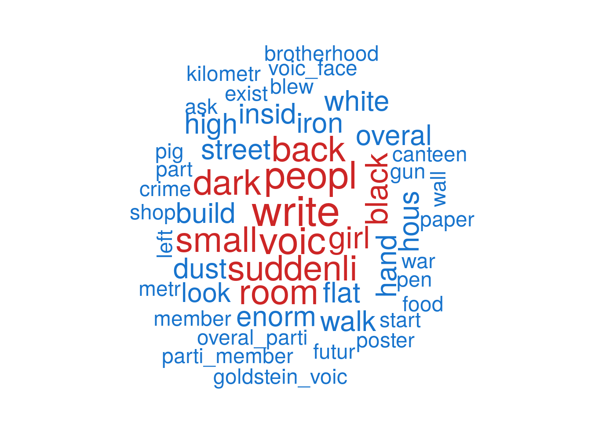
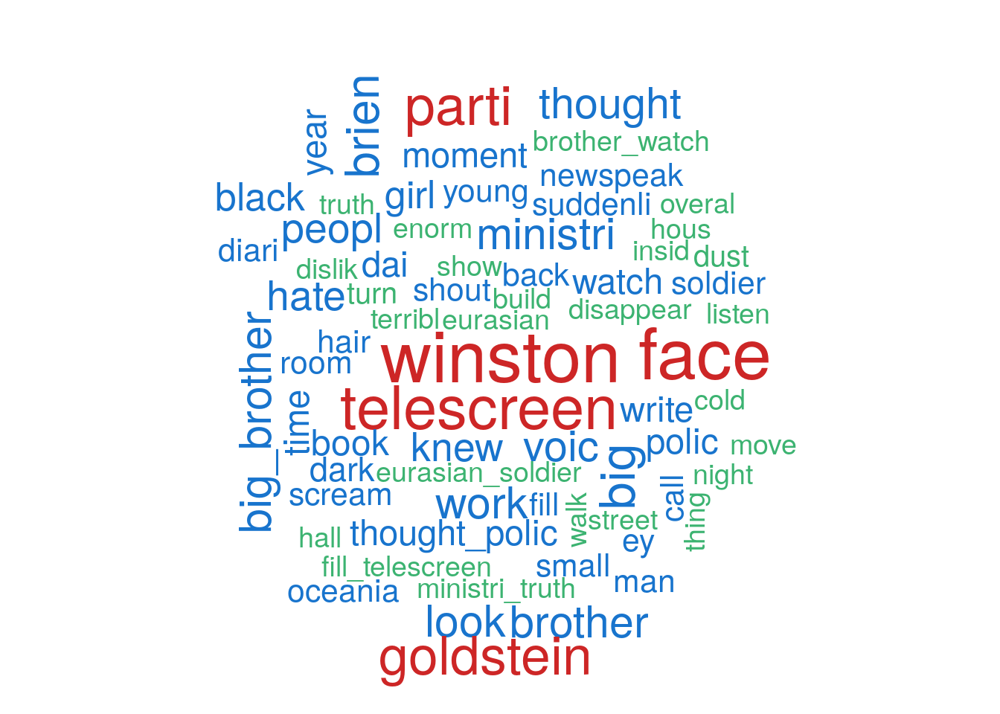

__In this repository you can find R code for summarizing one single text. The scripts are based on the package: *textmineR*.__

Currently the input only accepts .txt files and the working language is English. Any contribution or advise is wellcome.

## Intro

Nowadays we are sorrounded by tons of information. It comes from many different sources, and not all of it is relevant. The time limitation is a fact that must be also taken into account. For such reason, community is gathering efforts about ways to syntethize that information, keeping just the crucial part. Using machine learning and NPL we can deal with it.

Summarizing algorithms are frequently found to extract the main topics in a collection of documents. I haven't found many examples for single text summarizing. Stil, one interesting example can be found in the repo holding the package [*textmineR*](https://github.com/TommyJones/textmineR). There, the **centrality eigen-vector** algorimth is used. Here its results will be compared to those given by the **hierarchical clustering** based solution.

As an example text, it is used the first chapter of the George Orwell's novel [1984](https://english-e-reader.net/book/1984-george-orwell). The book can be found, as many other, on the website [english-e-reader.net](https://english-e-reader.net/).


## Code description

A .txt document must be selected and loaded. This will be the target document for both examples.


```r
library(textmineR)
```

```
## Loading required package: Matrix
```

```r
fileName <- '1984-George_Orwell_chap1.txt'
theName <- unlist(strsplit(fileName,'[.]'))[1]

myText <- readChar(fileName, file.info(fileName)$size)
```


In the first step all the prepocessing tasks are carried out. The text is split into the different sentences as shown in the following functions. For such, regular expression are used. 


```r
#' Clean text, remove scaped symbols, duplicated punctuation symbols and duplicated spaces. Set the text for future  
#' 
#' @param thisText target text
#' @param wthres threshold for the minimum number of words in a sentence. Sentences with a number of words equal or lower than wthres will be removed from the list.
#' @return cleant text

cleanText <- function(thisText, wthres = 3){
  thisText <- gsub("[\n*+]", ".", thisText)               # rm text scaped symbols
  thisText <- gsub("[\r\t*+]", "", thisText)              # rm text scaped symbols
  thisText <- gsub('([[:punct:]])\\1+', '\\1 ', thisText) # rm duplicated punctuation symbols
  thisText <- gsub('([[:space:]])\\1+', '\\1', thisText)  # rm duplicated spaces
  thisText <- unlist(strsplit(thisText, "[.]"))
  thisText <- gsub(" $", "", thisText)                    # rm final spaces
  thisText <- gsub("(^[[:space:]])", "", thisText)        # rm initial spaces
  thisText <- thisText[!grepl("^\\s*$", thisText)]        # take non empty sentences
  thisText <- unique(thisText)                            # rm duplicated sentences 
  chosenElement = sapply(strsplit(thisText, "\\s+"), length) > wthres
  thisText <- thisText[chosenElement]
  
  return(thisText)
}

doc <- cleanText(myText, 4)
names(doc) <- seq(along = doc)
```
One of the most important steps in the previous functions is the removal of the very short sentenced. Those with less than n words. The reason behind is to leave out short answers. Despite they don't provide any information, due to its repetitions they could appear in the summary, instead of a more interesting sentence. 

### Hierarchical clustering based solution.

Turn those sentences into a Document-Term Matrix (DTM), using stemming and bi-grams. DTM is a sparse matrix in which each document is represented by a term vector which, in turn, indicates if the a given term is present or not in it. The library *textmineR* is able to make the DTM at the same time it filters stop-words and uses stemming. As stopword list two list have been used, one of them from package *tm*. The stemming algorithm used is Porter's. 

```r
dtm <- CreateDtm(doc, 
                 ngram_window = c(1, 2),
                 stopword_vec = c(tm::stopwords("english"), # stopwords from tm, wider list 
                                  tm::stopwords("SMART")), # this is the default value
                 stem_lemma_function = function(x) SnowballC::wordStem(x, "porter"))
```

Term frequency matrix is required to get the TF-IDF matrix. To get this matrices, DTM is needed. TFIDF shows how important is a term in a document corpus, and it is used to calculate the distance matrix.

```r
idf <- log(nrow(dtm) / colSums(dtm > 0))

tfidf <- t(dtm) * idf

tfidf <- t(tfidf)
tfidf <- tfidf[-which(apply(tfidf,1,sum) <= 0),]
```

As distance metric, cosine similarity will be used. It is given by the following formula.

&space;=&space;\frac{\mathbf{A}&space;\cdot&space;\mathbf{B}}{\|\mathbf{A}\|&space;\|\mathbf{B}\|}&space;=&space;\frac{&space;\sum\limits_{i=1}^{n}{A_i&space;B_i}&space;}{&space;\sqrt{\sum\limits_{i=1}^{n}{A_i^2}}&space;\sqrt{\sum\limits_{i=1}^{n}{B_i^2}}&space;})

Calculate document-to-document cosine similarity and get distances.

```r
csim <- tfidf / sqrt(rowSums(tfidf * tfidf))

csim <- csim %*% t(csim)

cdist <- as.dist(1 - csim)
```

Get word weights. Words are the unigrams and bigrams which conform the DTM.

```r
p_words <- colSums(dtm) / sum(dtm)  #
p_sent <- rowSums(dtm)
```

Get clusters according to the distance measurements. the parameter *nsentences* points the number of sentences which will conform the summary. It is also the number of cluster needed.

```r
hc <- hclust(cdist, "ward.D")

nsentences <- 15
clustering <- cutree(hc, nsentences)

# clustering tree plot
plot(hc, main = "Hierarchical clustering",
     ylab = "", xlab = "", yaxt = "n")
rect.hclust(hc, nsentences, border = "red")
```

<!-- -->


To select the most representative sentence DTM has been used. The chosen sentences/documents are those with a higher euclidean norm within each cluster. It is considered that a sentence with a higher norm will also contain more representative term, and it is, more information. This option will lead to a more extense summary, what must be taken into account. Another feasible option is to take random sentences from each cluster, but it was discarded becasue the result wasn't so good.

```r
summary_sentences <- unlist(lapply(unique(clustering), function(x, document,weights){    # term list according to the cluster classification
  selected <- document[ clustering == x ]
  names(selected) <- names(document[ clustering == x ])
  chosename = names(sort(weights[names(selected)], decreasing = TRUE)[1])
  
  selected[chosename]
}, doc, p_sent))

sortindex = as.character(sort(as.integer(names(summary_sentences))))
summary_sentences <- summary_sentences[sortindex]

finalsum = paste(summary_sentences,collapse = '. ')
finalsum <- paste0(finalsum,'.') 
```

At last step, and optionally, the file can be saved into a file:

```r
if (!file.exists('outputs')){
  dir.create('outputs')}

savFile = paste0('outputs/','summary',nsentences,'sentences_',theName,'_hc.txt')
fileConn<-file(savFile)
writeLines(c(paste0(rep('#', 100), collapse = ''),finalsum, paste0(rep('#', 100), collapse = '')) , fileConn)
close(fileConn)
```

The **summary** is:

His hair was fair and the skin on his face, which used to be pink, was red and rough from cheap soap, old razor blades and the cold of the winter that had just ended. He moved to the window. The telescreen had a microphone, so the Thought Police could listen to Winston at any time of the day or night. And he could see the Ministry of Love - Miniluv - which was responsible for law and order. Earlier that morning, a terrible noise from the big telescreen at the Ministry of Truth had called all the workers to the centre of the hall for the Two Minutes Hate. Goldstein began to speak in his sheep-like voice: criticising the Party, making nasty attacks on Big Brother, demanding peace with Eurasia. Goldstein had also written a book, a terrible book, a book against the Party. As Goldstein's face filled the telescreen and Eurasian soldiers marched behind him, the Hate grew. Winston was shouting too; it was impossible not to. A girl behind him, with thick, dark hair was screaming 'Pig! Pig!' at Goldstein, and suddenly she picked up a heavy Newspeak dictionary and threw it at the telescreen. He disliked nearly all women, especially young and pretty ones. As the screaming at Goldstein increased, Winston's dislike of the girl turned to hate. There was sometimes an intelligence in his face that suggested - perhaps - that he might question the official Party beliefs. Winston wrote the date in his diary: April 4th 1984. You were, in Newspeak, vaporized.


#### Post -- clustering word extraction -- tag cloud

As final touch, the following code is used to get a tag cloud from the most important words in the chapter. Words from each cluster are extracted. We are considering the TFIDF metric to select the most important ones. 
This function will be used in the next chunk.

```r
cluster_words <- lapply(unique(clustering), function(x){
  rows <- dtm[ clustering == x , ]
  
  # drop all words that don't appear in the cluster
  rows <- rows[ , colSums(rows) > 0 ]
  
  colSums(rows) / sum(rows) - p_words[ colnames(rows) ]
})
```

Here, we create a summary table of the top words defining each cluster.

```r
cluster_summary <- data.frame(cluster = unique(clustering),
                              size = as.numeric(table(clustering)),
                              top_words = sapply(cluster_words, function(d){
                                chosennames = names(d)[ order(d, decreasing = TRUE) ][ 1:5 ]
                                chosennames <- chosennames[!is.na(chosennames)]
                                paste(chosennames,
                                      collapse = ", ")
                              }),
                              stringsAsFactors = FALSE)

cluster_summary <- cluster_summary[order(cluster_summary$size, decreasing = TRUE),]
```

And, at last, using the package *wordcloud*, two exaples are shown:

* Plot a word cloud of one cluster as an example

```r
whichclust = cluster_summary[1,1]
wccluster <- wordcloud::wordcloud(words = names(cluster_words[[ whichclust ]]),
                                  freq = cluster_words[[ whichclust ]],
                                  max.words = 50,
                                  scale=c(3,.5),
                                  random.order = FALSE,
                                  colors = c("mediumseagreen",  "dodgerblue3", "firebrick3"),
                                  main = paste("Top words in",theName,sep=' ' ))
```

<!-- -->


* Plot a word cloud of most important words under the tfidf metric 

```r
wcall <-wordcloud::wordcloud(words = names(colSums(tfidf)),
                             freq = colSums(tfidf),
                             max.words = 70,
                             random.order = TRUE,
                             scale=c(3,.5),
                             colors = c("mediumseagreen",  "dodgerblue3", "firebrick3"),
                             main = paste("Top words in",theName,sep=' ' ))
```

<!-- -->


### Eigen-value centrality based solution.

The full code is in the script *evc_code.r*. The preprocessing carried out in this case is the same than the previous one.

Analogously, TFIDF matrix is obtained

```r
idf <- log(nrow(dtm) / colSums(dtm > 0))

tfidf <- t(dtm) * idf

tfidf <- t(tfidf)
```


Again, cosine similarity is the metric chosen for the problem.


```r
csim <- tfidf / sqrt(rowSums(tfidf * tfidf))

csim <- csim %*% t(csim)


p_words <- colSums(dtm) / sum(dtm)  #
p_sent <- rowSums(dtm)
```

This cosine similarity matrix is turned into a nearest-neighbor network.

```r
nn <- csim

diag(nn) <- 0

nn <- apply(nn, 1, function(x){
  x[ x < sort(x, decreasing = TRUE)[ 2 ] ] <- 0
  x
})

nn <- nn * 100

g <- igraph::graph_from_adjacency_matrix(nn, mode = "directed", weighted = TRUE)
```

Calculate eigenvalue centrality.

```r
ec <- igraph::eigen_centrality(g)
```

Return the top central sentences as the summary.

```r
nsentences <- 15
summary <- doc[ names(ec[[ 1 ]])[ order(ec[[ 1 ]], decreasing = T) ][ 1:nsentences ] ]

summary <- summary[ order(as.numeric(names(summary))) ]
```

In this case, the **summary** is:

```r
finalsum <- paste(c(summary,''), collapse = ". ")
finalsum
```

Big Brother Is Watching You. He stared at the Ministry of Truth, where he worked. You could see the white roof, high above the houses, even a kilometre away. Behind Goldstein's face on the telescreen were thousands of Eurasian soldiers. As Goldstein's face filled the telescreen and Eurasian soldiers marched behind him, the Hate grew. He even thought she might be working for the Thought Police. He hated her because she was young and pretty. Then the face of Big Brother disappeared from the telescreen and the Party slogans came up instead:. Of course Winston shouted too - you had to. 'I am with you,' O'Brien seemed to say to him. 'I hate all this too. He did not know definitely that this was 1984. If you have that, everything else follows. Should he go on? If he wrote more or did not write more, the result would be the same. The Thought Police would get him. 


An again, if saving the result is required:

```r
if (!file.exists('outputs')){
  dir.create('outputs')}

savFile = paste0('outputs/','summary',nsentences,'sentences_',theName,'_ec.txt')
fileConn<-file(savFile)

writeLines(c('###########', finalsum, '###########' ) , fileConn)
close(fileConn)
```

